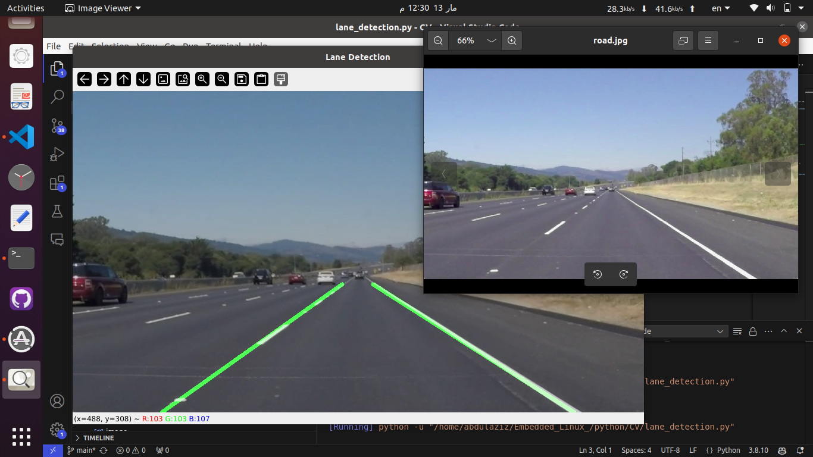

# Lane Detection Using OpenCV



## Introduction
Lane detection is a critical task in autonomous driving and driver assistance systems. This project implements a lane detection algorithm using OpenCV and NumPy in Python. The approach involves preprocessing an image, detecting edges, extracting lane lines, and overlaying the detected lanes onto the original image.

## Methodology
The following steps are performed to detect road lanes:

### 1. Image Preprocessing
- Convert the input image to grayscale using the `grayscale(image)` function to simplify computation.
- Apply the Canny edge detection method (`apply_canny(image)`) to detect significant edges in the image.

### 2. Region of Interest Selection
- A triangular region representing the area where lanes are typically found is defined in `define_region_of_interest(image)`.
- A mask is created and applied to the image, filtering out irrelevant regions.

### 3. Lane Detection Using Hough Transform
- The `detect_hough_lines(image)` function detects line segments in the processed image using the Hough Transform.
- Parameters such as `minLineLength` and `maxLineGap` are adjusted to filter meaningful lane lines.

### 4. Lane Filtering and Averaging
- Detected lines are categorized into left and right lanes using their slopes in `filter_and_average_lines(lines, image_height)`.
- Near-horizontal and vertical lines are filtered out to improve accuracy.
- The remaining lines are averaged and extended for better lane continuity.

### 5. Lane Overlay on Image
- The detected lane lines are drawn onto a blank image in `overlay_lines(image, lines)`.
- The final output is produced by overlaying this image on the original using `cv2.addWeighted()`.

## Code Implementation
```python
import cv2
import numpy as np

def grayscale(image):
    return cv2.cvtColor(image, cv2.COLOR_BGR2GRAY)

def apply_canny(image):
    return cv2.Canny(image, 50, 150)

def define_region_of_interest(image):
    height, width = image.shape[:2]
    region = np.array([[(100, height), (width // 2, height // 2), (width - 100, height)]], dtype=np.int32)
    mask = np.zeros_like(image)
    cv2.fillPoly(mask, region, 255)
    return cv2.bitwise_and(image, mask)

def detect_hough_lines(image):
    return cv2.HoughLinesP(image, 2, np.pi/180, 100, np.array([]), minLineLength=40, maxLineGap=5)

def filter_and_average_lines(lines, image_height):
    left_lines = []
    right_lines = []
    
    if lines is None:
        return None, None
    
    for line in lines:
        x1, y1, x2, y2 = line[0]
        slope = (y2 - y1) / (x2 - x1) if x2 - x1 != 0 else 0
        if abs(slope) < 0.5:  # Ignore nearly horizontal lines
            continue
        if slope < 0:
            left_lines.append((x1, y1, x2, y2))
        else:
            right_lines.append((x1, y1, x2, y2))
    
    def average_line(lines):
        if len(lines) == 0:
            return None
        x_coords = []
        y_coords = []
        for x1, y1, x2, y2 in lines:
            x_coords.extend([x1, x2])
            y_coords.extend([y1, y2])
        poly = np.polyfit(x_coords, y_coords, 1)
        slope, intercept = poly
        y1 = image_height
        y2 = int(image_height * 0.6)  # Draw the line up to 60% of the image height
        x1 = int((y1 - intercept) / slope)
        x2 = int((y2 - intercept) / slope)
        return x1, y1, x2, y2
    
    left_lane = average_line(left_lines)
    right_lane = average_line(right_lines)
    
    return left_lane, right_lane

def overlay_lines(image, lines):
    line_image = np.zeros_like(image)
    if lines:
        for line in lines:
            if line is not None:
                x1, y1, x2, y2 = line
                cv2.line(line_image, (x1, y1), (x2, y2), (0, 255, 0), 5)
    return cv2.addWeighted(image, 0.8, line_image, 1, 1)

def process_lane_detection(image_path):
    image = cv2.imread(image_path)
    gray_image = grayscale(image)
    edges = apply_canny(gray_image)
    masked_edges = define_region_of_interest(edges)
    detected_lines = detect_hough_lines(masked_edges)
    left_lane, right_lane = filter_and_average_lines(detected_lines, image.shape[0])
    output_image = overlay_lines(image, [left_lane, right_lane])
    cv2.imshow('Lane Detection', output_image)
    cv2.waitKey(0)
    cv2.destroyAllWindows()

process_lane_detection('road.jpg')
```

## Results
- The algorithm successfully detects lane lines in images where road markings are clear.
- It performs well under standard lighting conditions but may struggle with shadows, faded lanes, or highly cluttered roads.

## Limitations & Future Improvements
- The method relies on clear lane markings and may not work in complex environments.
- Shadows and extreme lighting variations can cause incorrect detections.
- Further improvements could include:
  - Using deep learning-based lane detection methods.
  - Implementing adaptive thresholding for varying lighting conditions.
  - Enhancing robustness against occlusions and missing lane markings.


